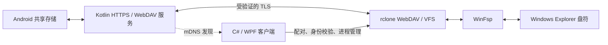

# 架构约束与设计边界

状态：P1-001 至 P1-030 已完成 Windows 发现/挂载、v3 配对、严格 TLS、三种访问模式、恢复和最终自启动行为的限定验收；第 8 节以后同时保留各任务当时的架构记录。历史阶段结论不能替代当前状态，原版上游源码事实由 [UPSTREAM_AUDIT.md](docs/UPSTREAM_AUDIT.md) 单独维护。

## 1. 固定链路

mDNS 只提供候选网络地址，TLS/配对决定身份；IP、型号、显示名称或服务名均不能作为信任凭据。手动 IP 添加走相同认证和安全规则，不作为绕过入口。

不替换为 SMB/FTP/SFTP/MTP/WebSocket 文件协议，不自建驱动。用户指定的架构决策见 [DECISIONS.md](DECISIONS.md)。

## 2. Android 职责

| 逻辑职责 | 要求 |
| --- | --- |
| 文件访问 | 用符合权限模型的共享存储访问；MediaStore 与直接文件访问的适用边界待实测确认；不承诺其他 App 私有目录。 |
| WebDAV | 元数据查询和流式传输；路径边界、写入完整性、覆盖/删除授权均在服务端执行。 |
| 身份与 HTTPS | Android Keystore 保护私钥及用于保护长期凭据的密钥；持久设备身份，证书变更触发重新配对。 |
| 发现 | 用 mDNS 公告端点及非秘密元数据；网络切换后正确撤销/重新发布。 |
| 服务生命周期 | 用户可开始/停止共享，低打扰前台通知；验证系统回收、Doze、开机恢复与权限撤销。 |
| 设备状态/界面 | 从资源文件读取 zh-CN/en-US 文本；耗时 I/O 不阻塞主线程；状态以真实服务结果为准。 |

共享根必须明确且可访问。目标目录不存在、权限撤销或 TLS 初始化失败应停止共享，不能回退扩大到整个存储或 HTTP。

Android 版本策略由 P0-007/D-02 确定：保留 minSdk 26 的安装下限，compileSdk/targetSdk 36 为本阶段实现基线。API 26/36 的本轮限定验证不代表所有中间版本或厂商系统均已通过；正式发布前继续核对当前平台要求。存储访问遵守[官方模型](https://developer.android.com/training/data-storage/manage-all-files)。

前台共享采用 `connectedDevice`，承载用户开启的本地电脑网络共享会话，声明该类型的权限，沿用真实 mDNS 所需的 `CHANGE_WIFI_MULTICAST_STATE` 前提。官方将网络外部设备交互列入该类型。P0-007 已验证实际类型和相关重启/恢复断言，准确范围及测试工具失败见[报告](docs/audit/P0-007-VALIDATION.md)。[类型规则](https://developer.android.com/develop/background-work/services/fgs/service-types)、[时限](https://developer.android.com/develop/background-work/services/fgs/timeout)

系统重建正在共享的 sticky 服务时处理 null intent；停止或只查询状态时不留下可自动重建的空服务。用户明确开启开机共享后才请求启动，尊重强制停止、权限撤销和系统后台限制。前台服务不能保证绕过 Doze；Android 17 与厂商省电策略不在本轮通过声明内，后续按官方权限和真机证据补齐。

## 3. Windows 职责

下表是逻辑边界，不要求创建同等数量的项目、接口或后台服务。

| 职责 | 边界 |
| --- | --- |
| UI、托盘、设置、Localization | WPF 主界面；关闭窗口进入托盘；zh-CN 默认，zh-CN/en-US 动态资源和语言设置按数据根持久化；当前窗口、卡片、状态与托盘同步刷新。自启由用户选择。所有入口调用同一业务路径。 |
| DeviceDiscovery / Device Model | mDNS 与手动候选端点、稳定 Device ID、名称、连接状态；地址变化不创建第二个配对设备。 |
| Pairing / CertificateManager | 首次身份绑定、后续证书与公钥校验、身份变化中止；认证和文件传输必须使用一致的信任策略。 |
| CredentialManager | ADR-017 使用当前用户 DPAPI，整条身份/凭据/状态共同保护；普通设置仅存引用及非秘密元数据。P1-005、P1-008 已完成实现及限定验收。 |
| MountManager / AutoReconnect | 同一设备串行挂载/卸载；校验可用盘符和实际挂载就绪；管理取消、离线、睡眠唤醒及退避重试。 |
| RcloneManager | 固定已核验的可执行文件/版本；受控参数和凭据注入，消费输出，跟踪退出；不把“进程存活”当挂载成功。 |
| WinFspManager | 检查安装/版本/架构及实际可用性；需要时引导官方安装，不以目录存在判断健康。 |
| CacheManager | 明确每个设备的缓存归属、空间限额、待上传数据及恢复条件；不会自动清除未确认上传的数据。 |
| Logging | 结构化事件、轮转、脱敏、诊断包；不输出凭据、认证 Header 或文件内容。 |
| Update | MVP 后再实现；当前不创建更新服务、定时器或远端后端。 |

## 4. 连接与写入状态

当前状态模型区分“已发现、待配对、验证中、挂载中、已挂载、离线、身份变化、卸载中、失败”等产品状态；具体内部枚举/API 仍以源码为准。

- 已发现不能直接代表设备可信；身份验证失败或获取失败都不能发送长期凭据并继续挂载。
- 同一 Device ID 只能有一个正在执行的挂载转换；GUI、托盘、自动重连不得各自启动一个进程。
- 仅在盘符确实就绪后报告挂载成功；IP 更新后停止使用旧端点，重新验证身份。
- 用户主动卸载/停止后不能被普通自动重试立即重新挂载；等待用户重新连接或明确启用的后续策略。
- 离线时及时标记不可用/卸载，但记录并保留待上传缓存；卸载完成不等于最后一次写入已经到达手机。
- 断网可重试；身份变化、权限不足或写入完整性失败必须有不同处理，不反复弹窗或无限快速重试。

写入设计需先验证完整请求和磁盘条件，在共享范围内暂存、校验并提交；无法安全提交则保留原文件并明确失败。临时文件、缓存及恢复状态的准确布局须在相关实现任务决定，不在文档任务提前引入事务框架。

## 5. 配对、证书绑定与删除的当前状态

| 事项 | 当前实现 | 仍有限定的边界 |
| --- | --- | --- |
| 首次配对 | ADR-017 的手动 8 位一次性码、三轮 PAKE、CA 绑定、每电脑凭据和 Pending/Active 恢复已由 P1-004 至 P1-008 接入产品 | 未做独立密码学安全审计；二维码仅为保留格式，当前 UI 未实现扫描。 |
| rclone 的 TLS | 配对、session、状态、删除控制和文件传输均使用已保存设备 CA、系统 SAN 校验和受保护 token；不启用 `no-check-certificate` | P1-028 已验证一次真实 DHCP 地址变化；长期证书续期仍未单独验收。 |
| 删除确认 | 安全模式为默认，普通 WebDAV DELETE 和覆盖失败关闭；删除只经绑定客户端、路径和目标快照的 30 秒一次性确认执行 | Explorer 内直接删除不会弹出确认；用户需在桌面端独立确认。 |
| Android 后台 | 用户开始共享后使用公开前台服务、电池优化豁免请求和锁；Redmi、Samsung 的锁屏/Doze 已验收，停止共享后释放后台资源 | API 27/28、更多 OEM 和长期运行未作同等真机覆盖。 |

上述当前实现及证据边界分别以 [PROTOCOL.md](docs/PROTOCOL.md)、[PAIRING.md](docs/PAIRING.md)、[SECURITY.md](docs/SECURITY.md)和 [TESTING.md](docs/TESTING.md) 为准；限定验收不能扩大为独立安全审计或所有平台兼容性结论。

P0-008 已在真机确认：上游证书没有 SAN，真实 rclone 在指定信任证书后仍拒绝 IP 端点。P0-009 已按先架构、后实现的顺序确定稳定身份与地址证书关系；不能通过关闭校验、仅补当前固定 IP 或系统 hosts 改动来替代动态地址下的身份绑定。具体实现与验收见 [P0-009](docs/tasks/completed/P0-009-tls-identity.md)，机制已确定为 ADR-014。

P0-009 实施方案（先于代码记录，现限定验收通过）：每个设备有独立自签身份 CA，私钥与 TLS 私钥均存入 Android Keystore；公开身份证书原子保存，部分材料缺失/损坏或旧 PKCS12 身份存在时停止，不能自动替换已有身份。配对绑定的是该身份 CA 的 SHA-256 和设备 ID。地址服务器证书由该 CA 签发，含当前接口 IP 的 SAN，只限 serverAuth；TLS KeyManager 在新握手时检查地址/有效期并刷新地址证书，固定 TLS 密钥避免并发握手证书/密钥不匹配。身份 CA 变更须重新配对，地址叶证书合法轮换不会改变设备身份。

Windows/rclone 每个设备仅加载已配对身份 CA 的专用 PEM，通过 ca-cert 对实际连接作证书链及地址校验；不加入系统信任库，不接受发现/状态响应提供的新 CA，不启用 no-check-certificate。此方案把“设备身份证书指纹”与短期地址叶证书明确区分。P1-008 已完成正式一次性配对、信任材料保护和 Windows 全路径接入；P1-028 已验证一次真实 DHCP 地址变化。

当前限定证据：API 26/36 的真实 rclone 正向、身份/地址拒绝、进程重启及损坏材料恢复通过；两类模拟器与备用机各 8 项 Keystore/TLS 原生通过。手机实际 rclone 通过 loopback 和真实 LAN 两个端点，错误身份/地址拒绝及进程重启/损坏材料恢复通过；P1-026 已验证 Android 实际重启后手动恢复共享，P1-028 已验证实际 DHCP 地址变化后的同身份恢复。长期运行和长期证书续期仍未单独验收。限定范围见 [P0-009](docs/audit/P0-009-VALIDATION.md)、[P1-026](docs/audit/P1-026-VALIDATION.md)和 [P1-028](docs/audit/P1-028-VALIDATION.md)。

## 6. 性能与缓存

目录浏览读取元数据，不能为列目录加载整文件；网络和本地 I/O 异步执行。rclone 负责 VFS 缓存/读块/回写，客户端负责配额、归属、状态和恢复管理。参数由大目录、大文件和断网测试决定，不照搬上游 5 秒目录缓存与 10 秒轮询组合。

第一阶段沿用 Explorer 缩略图能力，不实现专用缩略图服务；是否造成批量原图读取必须测量，不能因未开发专用缩略图而宣称该性能目标已经满足。是否需要额外目录缓存由数据决定。

## 7. 目录与变更规则

Android 正式应用实现在 [android/](android/README.md)，Windows WPF 客户端在 [windows/](windows/README.md)，辅助工具在 [scripts/](scripts/README.md)，测试在 [tests/](tests/README.md)。Phase 0 补丁和实验脚本作为历史证据保留；当前产品状态以正式 Android 工程、Windows solution 和 P1 验收记录为准。

修改重大边界前更新本文件与 [DECISIONS.md](DECISIONS.md)，再进入代码任务。模块化以可验证需求为限，不因目录存在就提前创建复杂抽象。

## 8. P1-001 Windows 发现工程（实施前决定）

.NET 10 LTS SDK 10.0.401（2026-09-08 发布，官方 SHA-512 与 Microsoft 签名验证）锁定在 windows/global.json。首次交付核心模型、Windows 发现适配器、诊断入口和行为测试，WPF 仍为正式 UI 技术，当前不做新 UI。

发现层采用 Windows.Devices.Enumeration 的 DNS-SD AssociationEndpointService DeviceWatcher。Windows 系统处理 mDNS 报文、缓存和接口，C# 处理 Added/Updated/Removed/Stopped；使用 DNS-SD 协议 ID、local 域和 _phonebridge._tcp 筛选，不调用 Windows 配对 API。网络地址变化时停止旧 watcher、清除旧候选后重建，取消后等待 Stopped 并解除订阅，旧回调不能恢复已清除的候选。

所有记录是未认证候选，服务标识来自系统服务实例 ID，绝不使用显示名称或 TXT 指纹作为已配对身份。限制 TXT 数量/总长/单项长度、重复键、协议版本、HTTPS、端口及 IP 地址；支持 IPv4 和有明确 scope 的 IPv6 link-local。手动 IP 使用同一端点验证器，不接受域名、认证信息、路径或 HTTP。候选变更只发布语义改变，移除只针对准确服务 ID。发现不发起 TLS/认证/挂载，也不持久保存。

选择依据及限制见 ADR-015。真实多网卡表现、手机停止后的移除时限必须通过本机验证，不能仅从 API 设计推断通过。

P1-001 实测补充（先于修复）：手机撤销时 Python zeroconf 收到 remove，Windows 原生 watcher 在约 160 秒离线观察内没有 Removed，Ttl 属性为 null；同机重新枚举时无旧设备。证据 `.audit/runs/P1-001/removal-investigation-143928`。因此不能只依赖长期 watcher 的 Removed。保留 Windows DNS-SD 路线，每 12 秒结束本轮并重新枚举；已有候选跨轮保留，连续两轮没有有效广告则移除。网络接口变化立即清空并重建；明确的 Removed/无效更新立即撤销。此为候选刷新策略，不是已认证连接健康判断；具体离线时延由真机测试记录。

## 9. P1-002 只读挂载生命周期（实施前决定）

输入须由已确认身份引导提供：单设备公有身份 CA DER 与预期 SHA-256、规范化 IP/端口、共享子目录、临时内存认证凭据和空闲盘符。不得从 DeviceCandidate 自动建立信任。实验继续授权 USB 引导，不替代 D-03 正式配对。CA 在独立当前用户会话目录中写入后保持禁止写入/删除的只读文件句柄，实际 rclone 始终使用专属 ca-cert 校验链和地址。

rclone 固定 1.75.1 和既有 SHA-256；用绝对路径、ArgumentList、无 shell、隐藏窗口启动，清除外部 RCLONE/proxy 环境，认证材料只经 stdin/受控子进程环境传递，不进命令行或配置文件。obscure 仅为 rclone 输入格式，不是加密存储。产品输出只记录固定事件、状态、所属 PID 与退出码，不回显原始子进程输出或异常消息。

本任务只运行 read-only + VFS cache off 的网络盘符挂载。以独立随机 RC 凭据和 loopback 端口控制所属子进程，用 core/pid 验证进程归属、真实远端列表请求确认 TLS/认证和盘符存在，再声明 Mounted；不把 Process.Start 成功视为挂载成功。每个盘符有进程间租约。子进程加入 kill-on-job-close Job，宿主异常退出时由 Windows 清理；不按名称杀进程。

管理器区分 Idle/Starting/RecoveringWrites/Mounted/Stopping/Stopped/Failed/StopFailed。重复启动拒绝，停止可并发、取消启动先清理；正常 core/quit 后等待进程退出和盘符消失。只读会话在正常卸载超时后允许终止自身子进程，并明确标记 forced；不能据此用于含待上传数据的读写会话。清理未证实则保留所有权并报告 StopFailed，可重试，不宣称已卸载。退出前复核单元/进程行为和手机合成目录的实际只读挂载。

P1-002 复核补充：先 Process.Start 再 AssignProcessToJobObject 留有宿主崩溃窗口。改为 Windows 10+ 的 CreateProcessW / STARTUPINFOEX，在创建时通过 PROC_THREAD_ATTRIBUTE_JOB_LIST 绑定 Job；HANDLE_LIST 只继承三个标准管道，不继承 Job 句柄。ArgumentList 在唯一原生边界按 Windows 引用规则序列化，无 shell；保留创建返回的进程句柄，等待/终止不依赖再次查找 PID。该 Win32 适配仅承载已固定的 rclone 参数，不提供任意外部命令接口。

## 10. P1-003 配对契约（历史设计阶段；现已实施）

ADR-017 选择 J-PAKE：手机显示一次性 8 位数字，独立、限时的配对 TCP 端口只交换公有证明和 CA；通过三轮显式密钥确认绑定 CA 后，关闭该端口，后续授权和文件传输只走严格校验该 CA 与地址的 HTTPS。手机明确批准每电脑独立 token；Windows DPAPI 先保存 Pending，Android Keystore 保护验证值和元数据。具体帧、限额、恢复、撤销、存储及 22 项实施验收见 [PAIRING](docs/PAIRING.md)。

P1-003 当时仅增加设计材料、合成向量及离线 Java/C# 库互操作探针；实验引用固定 Bouncy Castle Java 1.86 / C# 2.7.0，未加入正式 Windows solution，也未升级当时的 Android APK。后续 P1-004 至 P1-008 已完成正式模块、Android 宿主和 Windows WPF 接入。

14 项库互操作与 11 项向量检查通过，限制及来源见 [P1-003 验收](docs/audit/P1-003-VALIDATION.md)。该阶段的离线探针不证明完整 wire 协议、Android 性能、授权界面或安全存储；当前产品证据见 P1-007/008。发现解析器现同时识别实验 v2 和产品 v3，但界面不连接 v2、不降级旧认证。

## 11. P1-004 纯协议核心（实施前记录，现限定验收通过）

Windows 增加 PhoneBridge.Pairing，Android 增加独立 pairing-core Kotlin/JVM 模块；不接网络/存储，不改实验 APK。顺序状态机只允许 8 帧交替收发，错误/取消后终止，不复用库 participant。增量接收器只组装一个预期帧，头验证后才分配有限 payload，拒绝尾随数据；宿主负责网络截止时间、连接预算和发送完成/EOF。结果只表示 PAKE 确认的候选 CA 与短命 grant，仍需解析验证 CA、严格 TLS、持久化及用户批准，不能直接挂载。

固定 BC C# 2.7.0 / Java 1.86；新独立模块使用 Kotlin 2.4.0、既有 Gradle 9.3.1 / JDK 21，输出 JVM 1.8 字节码并限制 Java 8 API。该组合位于 [Kotlin 官方兼容表](https://kotlinlang.org/docs/gradle-configure-project.html)的 2.4.0 支持范围，Maven Central 已核实版本存在；不升级上游 Android 构建。最终 Android API 26 运行兼容仍须设备验收。

P1-004 最终 124 项 Windows、15 项 Kotlin 与 59 项管道互操作通过，源码复核及限制见 [验收](docs/audit/P1-004-VALIDATION.md)。尚无手机/网络/存储接入，结果不授权文件操作。

## 12. P1-005 Windows 受保护记录（实施前记录，现限定验收通过）

新增 PhoneBridge.Credentials / PairingStore，使用系统 CryptProtectData/CryptUnprotectData，固定 UI_FORBIDDEN、当前用户，额外熵绑定协议用途和设备 CA hash；不使用 LocalMachine，不增加安全存储 NuGet 依赖。每条记录的版本、CA/指纹/device_id、client_id、随机 32-byte token、名称、状态/模式与修订号一起保护；有界二进制格式而非普通设置 JSON。P2-004 将 Windows 记录格式升为 schema 2，追加本地显示别名和旧版长备注，并保持 schema 1 只读兼容；r18 界面只把显示别名呈现为“设备备注”，旧长备注仅保留格式兼容。更新使用同一修订号比较交换和原子提交，不改变 device_id、client_id、token 或证书身份。CA 须为单一规范 DER、自签名有效、RSA >=2048/SHA256withRSA、CA/KeyCertSign 和当前有效期满足要求，匹配已确认指纹。

Android 加密 PairingStore 的 `PBS1` 记录在 r18 升为 version 2，为每个已配对电脑追加最多 64 个 Unicode 标量、128 UTF-8 字节的本机“设备备注”；version 1 继续读取为空备注，首次受控写入升级为 version 2。备注只参与本机显示，不进入 mDNS、配对、session、WebDAV 或访问模式判定，更新备注不关闭现有 socket。

默认目录为 LocalAppData/PhoneBridge-NG/Pairings-v1。创建时使用当前用户/SYSTEM 专属 ACL；既有宽松 ACL 不自动修正。操作期间固定各级目录句柄，拒绝重解析点；记录/锁/临时文件检查 owner、DACL、类型和硬链接数。独占锁文件串行跨进程事务；只写随机命名密文临时文件，Flush(true) 后同目录 move/replace，并回读提交结果。Windows 文件替换失败可能留下不确定状态，不能宣称必然未提交；本实例停止后续凭据使用，新实例重新加载磁盘状态。进程中断不等于断电持久性已测。

Pending 成功落盘前不导出 token；按用途读取凭据：Pending 只能用于配对提交/状态验证，Active 才能用于挂载，RevocationPending 只能用于撤销，NeedsRepair 不导出。状态更新校验 client/revision，Active 模式只能按新的已验证 session 刷新；迟到的激活不能恢复已禁用记录。现有同设备记录不自动覆盖，缺失/损坏不自动重建。存储校验不证明 HTTPS 已通过；ApplyVerifiedSession 仅供后续严格 TLS/token 验证路径调用。本任务不发网络请求、不挂载、不改手机。

依据：[DPAPI](https://learn.microsoft.com/en-us/windows/win32/api/dpapi/nf-dpapi-cryptprotectdata)、[ReplaceFile](https://learn.microsoft.com/en-us/windows/win32/api/winbase/nf-winbase-replacefilew)、[Windows 文件安全](https://learn.microsoft.com/en-us/windows/win32/fileio/file-security-and-access-rights)。同一 Windows 用户中的恶意程序/管理员可越过本地应用边界；DPAPI 不防其恢复旧的有效密文，不宣传为防回滚保险库。

P1-005 复核修正（先于代码）：全 solution 并行回归复现原生打开 Busy 与 ReplaceFile 0x80070497（1175）。[官方说明](https://learn.microsoft.com/en-us/windows/win32/api/winbase/nf-winbase-replacefilew)确认 1175 保留两个原文件名；[文件写入建议](https://learn.microsoft.com/en-us/windows/apps/develop/files/best-practices-writing-files)将其归因文件占用并建议同步/重试。保留独占事务锁与权限检查，只对 CreateFile 的 32/33、ReplaceFile 的 1175 做至多 10 次间隔 25ms 的额外重试；替换重试前重新检查目标/临时文件 ACL 和类型。不重试 1176/1177、其他 I/O 或整个授权事务，不删旧记录再写。占用者尚未确认，不归因杀毒软件，不更改系统策略。

确定性占用复现补充：测试在提交前持有旧记录只读句柄，File.Replace 返回 0x80070020（32），而并行回归此前返回 1175。官方 ReplaceFile 的其他错误分支也保留两个原文件名；有限替换重试因此明确包括 32/33/1175，仍排除 1176/1177。仅扩充已确认占用错误，未改变提交语义。

## 13. P1-006 Android 配对记录（实施前记录，现限定验收通过）

增加独立 Android library 工程 android/credentials-store，沿用已核实兼容的 AGP 9.1.1、Gradle 9.3.1、JDK 21、build-tools 36.0.0、compile 36/min 26；使用 AGP 内置 Kotlin 2.2.10，不接入或修改 Kotlin 2.4 配对核心/现有 APK。仅系统 Keystore/JCA AES-256-GCM，无新增密码库；测试使用独立包与合成材料。

存储固定在 credential-protected noBackupFilesDir 下，拒绝 device-protected Context，检查 UserManager.isUserUnlocked（首次解锁边界，不要求每次亮屏认证）。独立 Keystore alias、随机化加密强制开启，由 Cipher 生成 12-byte IV，tag=128；AAD 绑定用途/schema/本机 CA SHA。整个有界二进制集包含 schema、CA SHA、正修订号、每电脑 client_id、token 验证值、名称、模式、Active/Revoked 状态；验证值按 PAIRING 第 6 节计算，不保存 token。最多 16 Active、128 总记录、总密文 <=64KiB；保留 Revoked 防止同 client_id 复活，容量满需明确处理，不自动驱逐。

打开既有库与为全新身份初始化分为两个 API。初始化只能由宿主全新身份创建流程显式调用，不由失败加载触发；key/file 任一已存在拒绝初始化。此模块不拥有 CA 私钥生成流程，宿主必须证明该身份确为本次新建，不能把已有 CA 的资料丢失当首次安装。key 创建后、文件提交前崩溃会留下不一致并拒绝加载，不自动换 key。

目录 0700/文件 0600、owner UID、普通类型与 nlink 检查、O_NOFOLLOW/CLOEXEC；同进程 gate + 文件锁串行事务。临时文件仅写密文，FileDescriptor.sync/Os.rename/目录 fsync 后回读；不使用会吞掉 sync 失败的便利提交路径。写失败或库损坏使该存储在本进程中的所有实例禁用，重启后以持久记录为准，不宣称失败撤销已持久化。每次授权重新读取；提供短小授权提交回调，在同一锁内重新校验并执行提交，供后续 WebDAV 共用撤销屏障；不在锁内传输网络流。

只有批准方法可以写 Active；重复 client_id 不覆盖，修改/撤销/本地删除均校验修订号。远端 self-revocation 保留 Revoked 记录，手机用户明确“移除此电脑”则从加密库精确删除整条记录；两者都与授权提交共用锁，旧 token 随即失效。HTTP 窗口、批准/取消竞争、活动流取消和停止共享由后续授权层集成。应用设置云/D2D 备份排除，仍须实际 OEM 验证。Keystore 不防已控制同 UID 进程/Root 或旧有效密文回放；KeyInfo 如实报告，不推断 StrongBox。

来源：[AGP 9.1.1](https://developer.android.com/build/releases/agp-9-1-0-release-notes)、[Keystore](https://developer.android.com/privacy-and-security/keystore)、[随机 IV 要求](https://developer.android.com/reference/android/security/keystore/KeyGenParameterSpec.Builder#setRandomizedEncryptionRequired(boolean))、[noBackup](https://developer.android.com/identity/data/autobackup)。

P1-006 复核修正：公开 Android SDK 不提供 O_DIRECTORY / unlink；使用 O_RDONLY 打开目录后 fstat 校验类型、Os.remove 删除所属临时文件。O_CLOEXEC 的 Java 常量从 API 27 才公开，fcntlInt 从 API 30 才公开；API 26 按 [AOSP bionic](https://android.googlesource.com/platform/bionic/+/refs/tags/android-8.0.0_r1/libc/kernel/uapi/asm-generic/fcntl.h) 的 O_CLOEXEC=02000000 数值直接传给公开 Os.open，原子设置而非事后补标志，不调用隐藏 API。

原生测试复现 Android FileOutputStream(fd) 不拥有传入 fd，关闭 stream 不会关闭该描述符；依 [AOSP 实现](https://android.googlesource.com/platform/libcore/+/refs/tags/android-8.0.0_r1/ojluni/src/main/java/java/io/FileOutputStream.java)增加显式释放，API 26/36 均通过重复事务后的零残留句柄断言。硬链接创建被两平台拒绝（API 26 的 SELinux audit 已明确原因），保留拒绝证据，不宣称已运行覆盖 nlink>1 的库内分支。最终各 26 项原生、3 项进程恢复通过，详见 [P1-006](docs/audit/P1-006-VALIDATION.md)。

## 14. P1-007 Android 应用集成（实施前记录，现限定验收通过）

正式工程放在 android/app，独立 applicationId=org.phonebridge.ng，不覆盖 com.phonebridge 实验 APK。AGP 9.1.1 内置 Kotlin 2.2.10 统一编译 App；以 sourceSets 直接引用已有 pairing-core/credentials-store 源文件，避免 2.2 编译器读取 2.4 metadata，不复制/分叉两模块逻辑。重新在 Android 编译和运行这些相同源文件；旧 JVM 2.4 与独立存储构建保留。固定 BC prov/pkix/util 1.86，TLS 证书和 PAKE 统一同版本；不更改旧 APK。版本兼容依实际 D8/设备测试证明。[AGP Kotlin 依赖](https://developer.android.com/build/releases/agp-9-1-0-release-notes)、[sourceSets 规则](https://developer.android.com/build/migrate-to-built-in-kotlin)

从固定 P0-009 副本导入证书、TLS、SharedPath/SharedStorage、Range/XML/RequestBody 辅助代码，保留许可和逐文件来源。宿主只在本次新建 TLS 身份时初始化配对库；已有身份加载失败停止，不退回密码、不新建空授权库。Activity 通过非导出 Service 的进程内 Binder 控制共享/配对/本地批准；P2-004 起不设置应用级截屏阻挡，所有 UI 文案使用中英文资源。网络/磁盘/密码运算均离开 UI 线程。共享服务类型沿用 connectedDevice，独立通知、明确开始/停止。P2-004 的服务在共享引擎停止后保留加密库的非秘密客户端快照，离线详情、访问模式更新和本地删除重新打开同一 PairingStore，不把“停止共享”解释为“没有配对”。既有七个共享目录索引保持不变，末尾追加 `Environment.getExternalStorageDirectory()` 的内部共享存储根；Android 系统不可访问的私有目录仍不在承诺范围。

Android 页面返回由统一页面状态处理：语言页回设置，设置/电脑详情回首页；尚未批准的配对页离开时取消窗口，已经批准的 Active 结果则按协议保留到原 120 秒期限，供 Windows 完成状态轮询和严格 session 验证。首页二次返回在共享中只把任务置于后台，前台服务继续；设置中的显式退出先发送 STOP 再结束任务。配对专用服务在窗口自然结束且没有开始共享时自动停止；用户仍可重新选择共享目录再开始共享。

配对窗口依 elapsedRealtime 120 秒、5 次已接受连接、单握手工作者、30 秒总握手/5 秒帧截止和10秒重开间隔；调度器以关闭所属 socket 保证写阻塞也可取消。8 帧复用既有核心；Windows 发完第7帧后 half-close 输出，Android 检查 EOF 后发送第8帧并关闭 TCP，尾数据失败。确认后立刻关闭配对监听/广告，仅留到原期限的 grant SHA-256 与单次请求状态。未批准 token 只在内存，关闭/拒绝/取消/到期清零；批准持久完成再返回 Active。批准/取消/超时在同一状态锁内串行，已 Active 的取消返回冲突。

继续 NanoHTTPD 2.3.1 HTTP 路线；其原版 decodeHeader 会用 Map 覆盖重复 Authorization，因此正式 App 将官方 BSD 源码随源码分发，作限定补丁：严格 request-line/header、重复字段拒绝、512-byte auth、8KiB完整头、有界连接执行器、固定错误消息与禁止异常原文日志。原始来源/hash与补丁需保存。控制接口认证在业务体解析之前；严格 JSON（唯一字段/类型/UTF-8/长度/尾数据），不使用 parseBody 的普通临时文件；不压缩、不跳转、不访问系统代理。

每个 Basic 请求新验证，按 client 跟踪所属 socket；撤销先阻止新请求，再持久提交并关闭该 client 的其他活动连接，完成后回执。self 撤销连接保留到204发送；存储失败使整个服务拒绝请求并停止。文件路径复用已验证模块，暂只放行 OPTIONS/PROPFIND/GET/HEAD，所有写方法拒绝，默认保存模式仍为 SAFE；安全模式删除/覆盖和缓存不由此任务假装完成。保留 /phonebridge 控制空间，不落入文件路由；不恢复浏览器 HTML 目录入口。

P1-007 实施复核：HTTPS 同时最多 8 个连接工作者，拒绝排队，第一个字节至完整请求处理最多 5 秒；授权成功后的文件流由 socket 所有权管理，撤销/停止关闭。HTTP ingress 拒绝重复字段、非法 CRLF/UTF-8、查询/fragment、Transfer-Encoding/Content-Encoding/Expect，保留字面加号。已有路径模块再次规范化，不能让解码后的控制路径落入文件服务。后台取消与排队开启之间使用前台 generation 校验；配对倒计时不重建批准按钮；客户端快照按 revision 单调更新。

BC 三个 JAR 的相同 LICENSE.md 打包合并。Lint 仅在 app/lint.xml 对 bcpkix-jdk18on-1.86.jar 的 TrustAllX509TrustManager 报告作精确路径例外：官方源码的未调用 EST JcaJceUtils 工具包含此方法，本项目仅使用证书构造 API，不引用 EST。此规则对项目和其他依赖仍开启，不安装该提供者或使用它构造客户端信任管理器；严格 TLS 的错误 CA/SAN 原生拒绝已在 P1-007/008 验证。升级依赖必须重新检查此例外。[官方 EST 源码](https://github.com/bcgit/bc-java/blob/r1rv86/pkix/src/main/java/org/bouncycastle/est/jcajce/JcaJceUtils.java)

P1-007 API 36 复验修正：活动下载撤销连续两次在约 5 秒后使 self 请求失去回执；系统 ConscryptEngineSocket.close 会先 drain TLS 关闭通知，底层写阻塞时不能用普通 close 保证撤销时限。撤销/关停/请求期限的强制中断改为 API 29+ 通过公开 ParcelFileDescriptor.fromSocket 取得独立 dup，Os.shutdown(SHUT_RDWR) 后释放 dup、再关闭 TLS socket，先终止传输再释放 TLS 资源。API 26 保留实测可中断的 close；不使用隐藏 API 或反射。API 29 前 fromSocket 不复制 fd 的官方陷阱使该分支不可直接下放，API 27/28 尚未实测。正常完成响应仍由 NanoHTTPD 常规关闭。最终 API 26/36 实际撤销与句柄回归均通过。

## 15. P1-008 Windows 配对与 WPF 入口（已实施）

新增 PhoneBridge.Connection 组合既有发现、PAKE、DPAPI 和只读 MountManager；PhoneBridge.Desktop 是最小 WPF zh-CN/en-US 客户端。沿用固定 .NET 10，不增加 UI/网络 NuGet 框架。UI 只处理短输入与状态，网络、密码学、磁盘及挂载事务在工作线程运行；关闭窗口取消配对并等待所属挂载清理，失败保留窗口与清理重试入口。同一 Windows 用户只运行一个正式桌面实例。

发现同时保留实验 v2 和正式 v3；v3 必须包含 paired-v1 与规范 device_id，配对三字段必须完整且有效。字段均为未认证路由提示，变化必须触发候选更新。新版界面不连接 v2、不导入旧密码。每次操作冻结所选候选；首次 PAKE 在一个选定 IP 完成八帧与双向 EOF，随后 HTTPS 只使用同 IP 和已确认端口，CA 来自确认结果；不在提交凭据后跟随广告切换。重连使用保存 CA，广告 device_id 仅帮助查找记录。

HTTPS 使用 SocketsHttpHandler 的 CustomRootTrust、原生 SAN 校验和 serverAuth 策略，无证书接受回调；禁用代理、重定向、Cookie、压缩，限制头/正文和端到端截止时间。严格校验 JSON 唯一字段、类型、身份、client_id、状态及 no-store。先持久 Pending 再 POST；超时保留 Pending，恢复仅查询已保存 token 的 session。身份正确的 session 可在 `share_ready=false` 时完成配对并激活记录，但不得挂载、启动 rclone 或设置恢复意图；只有用户之后手动连接且 session 为 `share_ready=true` 时才挂载。配对取消先持久 RevocationPending，尝试 grant 取消及长期 token 撤销；离线保留禁用记录，不以超时推断未批准。

凭据库同时保留两条路径：配对取消/兼容流程可在已确认远端撤销后删除 RevocationPending；当前 Windows 用户“移除此手机”则先停止所属挂载，再直接删除本机精确记录，不发网络请求。后者同时清除临时端点和自动恢复状态；手机端可能仍保留旧授权，因此不得宣称远端也已删除。重新连接必须创建新 client_id/token，不覆盖任何仍存在的本机记录。

WPF 显示附近设备和离线保存记录、短码输入、等待手机批准、配对/连接/取消/打开/卸载/移除，以及只读开发能力说明。“配对”只保存已验证身份和凭据，不自动连接、挂载或启动恢复；手机开始共享后，用户从设备卡片手动点击“连接”。当前“移除此手机”只清理 Windows 本端并返回未配对候选；不要求手机确认。rclone 从程序目录 tools/rclone.exe 加载，沿用固定 SHA-256 与 WinFsp 检查；不把 .audit 路径写入产品。当前只有一台设备的活动挂载；驱动器由用户选择可用字母，凭据只从受保护记录取得。

依据：[WPF 线程模型](https://learn.microsoft.com/en-us/dotnet/desktop/wpf/advanced/threading-model)、[CertificateChainPolicy](https://learn.microsoft.com/en-us/dotnet/api/system.net.security.sslclientauthenticationoptions.certificatechainpolicy?view=net-10.0)。严格 TLS 拒绝、持久状态竞争和 Redmi K40 的 NG→WPF→rclone→WinFsp 真实链路已由 P1-008 通过；测试入口未进入产品二进制。

## 16. P1-009 安全写入与删除确认

服务端按每个已配对客户端的模式授权，Windows 传入同一模式只用于配置 rclone 行为，不能替代服务端检查。只读模式继续拒绝全部写入。安全模式允许仅创建新目标的 PUT、MKCOL、COPY，以及目标不存在时的 MOVE；PUT/COPY/MOVE 不得覆盖已有文件或目录。完全读写模式仍受共享根、符号链接、请求完整性与原子提交约束，可按 WebDAV 覆盖语义执行。根目录永远不能修改。

PUT 必须带有效 Content-Length，十进制上限为 20,000,000,000 字节，与强制 20 GB 验收口径一致；超限在创建暂存文件前失败关闭。在共享目录内创建随机暂存文件，完整接收并同步后才提交。提交前重新检查源、目标及授权状态；短写、断连、撤销、冲突或目标变化均不替换原内容。上传连接采用 120 秒无进展截止时间，持续接收正文时每 30 秒续期，避免把正常的大文件持续传输误判为超时。

Windows 的 SAFE/READ_WRITE 挂载使用 rclone `writes` 缓存，READ_ONLY 继续使用 `off`。缓存根位于当前用户 LocalAppData，按已验证设备身份固定隔离，并由设备级跨进程租约保证没有重叠挂载。固定 32 GiB 最大缓存、2 GiB 目标最小剩余空间、关闭文件后立即写回；开放文件可能临时超过限额。正常卸载先以受认证 RC 确认上传队列、进行中上传、错误文件和空间状态全部干净，否则保留进程和盘符供重试，不强制结束。意外退出保留缓存，同设备下次以相同参数恢复；产品代码不递归清除未知或待上传缓存。具体边界见 ADR-021。

安全模式的普通 WebDAV DELETE 始终拒绝。桌面端通过受认证 HTTPS 准备一个精确目标：服务端保存客户端 ID、规范路径和目录树快照，返回不可预测的一次性 ID；Windows 显示实际目标并取得确认后，在 30 秒内调用执行接口。执行尝试先消费 ID，再核对同一客户端、期限、路径快照及当前授权；失败和成功均不可重放。最多保留 16 个确认，重启或停止共享即全部失效。完全读写模式可直接 DELETE，但当前 UI 不提供切换模式。

撤销与最终文件系统提交共用服务端门闩：上传正文和复制暂存不持有门闩，提交前在门闩内重新认证；撤销先阻断客户端并中止连接，因此已撤销请求不能在随后提交。门闩只包住最终 rename/mkdir/delete，不包住网络传输或大文件复制。

P1-009 当时的实施验收：218 项 Windows 测试、最终 Android 构建/Lint、45 个逐项真机仪器用例和 Redmi K40 的 SAFE Explorer 链路通过。过期删除确认在服务端失败关闭，刷新确认后才删除；安全卸载后盘符和 rclone 消失，稳定缓存保留。该任务当时未覆盖的大文件、真实断网和 Samsung，后来分别由 P1-011、P1-016 至 P1-020 完成限定验收；磁盘满仍未实机验证。

## 17. P1-010 锁屏共享与断线自动恢复（已实施）

用户明确开始共享后，Android `connectedDevice` 前台服务拥有服务端、mDNS 组播锁和一个非引用计数的 `PARTIAL_WAKE_LOCK`。WakeLock 在服务启动提交前取得，在停止、启动失败、存储故障和服务销毁时释放；不得使用固定六小时超时造成仍显示“共享中”但 CPU 保持已静默失效。锁屏只关闭配对窗口，不停止已批准客户端或文件服务。

Redmi K40/API 36 实测在未豁免电池优化时，锁屏立刻把 PhoneBridge WakeLock 标记为禁用并切断局域网可达性；Windows 连续三次健康检查失败后按设计安全卸载。Android 官方同时明确 Doze 会暂停网络并忽略 WakeLock，只有部分豁免应用可在 Doze 中使用网络和部分 WakeLock。因此开始共享必须先检查 `PowerManager.isIgnoringBatteryOptimizations()`；未豁免时暂停启动，并通过带 `package:` URI 的 `ACTION_REQUEST_IGNORE_BATTERY_OPTIMIZATIONS` 交给用户明确决定，返回后再次检查，拒绝或失败则保持停止。应用声明普通级 `REQUEST_IGNORE_BATTERY_OPTIMIZATIONS`，不静默修改白名单、不使用厂商私有接口。项目只作第三方 App 分发，不以品牌应用商店审核为约束；锁屏传输期间增加耗电是用户已接受的明确行为。

离开 Activity、回到桌面或锁屏不等于退出共享，否则锁屏访问无法成立。用户点击应用或通知中的“停止共享”，或从最近任务中明确移除 PhoneBridge，才表示结束本次共享；服务必须清除恢复标记、停止 HTTPS/mDNS、释放 WakeLock/MulticastLock并移除前台通知。应用不注册开机自启或后台守护，停止后无 PhoneBridge 后台服务。

Windows 连接监督只对用户已经成功连接的设备保留恢复意图和原盘符。候选广告消失本身不卸载；客户端以严格 TLS 和保存凭据周期核对 session，连续三次暂时性失败后才尝试安全卸载。卸载仍受 ADR-021 的待上传保护，无法确认写队列干净时保留挂载和缓存，不强杀。身份、授权或模式变化属于终止错误，不自动重配对。

安全卸载成功后，只接受 `device_id` 与保存身份一致的 v3 候选，并重新执行严格 session 校验后挂载原盘符。同一时间最多一个健康检查或恢复操作；失败按 2、5、10、20、30 秒退避。用户主动卸载、撤销、取消或退出会清除恢复意图，避免立即反向重挂。恢复只在当前桌面进程生命周期内生效；开机自启、持久盘符偏好、托盘和 PC 睡眠唤醒另行验收。

P1-010 当时的实施验收：Redmi K40/API 36 在用户授予电池优化豁免后，真实锁屏/Dozing 状态的 P: 读写和手机端独立哈希通过；关闭 Wi-Fi 后客户端按三次失败规则安全卸载，恢复 Wi-Fi 后在仍锁屏状态自动恢复同一 P:。该任务当时未覆盖的 Samsung、大文件中断和 PC 睡眠后来分别由 P1-011、P1-016 至 P1-020、P1-029 完成限定验收；长期运行仍未单独验收。

P1-011 实施验收：Samsung SM-S9180/API 36 使用同一公开权限与前台服务方案完成首次配对、P:、Dozing/Keyguard 下双向读写和手机独立散列，不需要三星私有后台白名单。最近任务移除和通知停止均关闭共享并触发 Windows 安全卸载；系统可能保留 `CACHED_EMPTY` 进程作为内存缓存，但无服务、通知、端口、锁、活动组件或 CPU 增量，不属于后台共享。再次手动共享复用既有身份并自动恢复原盘符。

## 18. P1-012 Windows 托盘生命周期（已实施）

桌面应用继续保持当前用户单实例，并使用 .NET Windows Forms `NotifyIcon` 作为 WPF 的托盘宿主；不引入第三方托盘包。托盘只负责显示状态和转发“打开”“退出”，连接、挂载和恢复仍由唯一 `MainWindow`、`ConnectionClient` 与 `MountManager` 持有。[NotifyIcon](https://learn.microsoft.com/en-us/dotnet/api/system.windows.forms.notifyicon?view=windowsdesktop-10.0)、[ContextMenuStrip](https://learn.microsoft.com/en-us/dotnet/api/system.windows.forms.notifyicon.contextmenustrip?view=windowsdesktop-10.0)。

普通窗口关闭在托盘可用时只隐藏现有窗口，不取消连接、不卸载盘符、不新建窗口。双击图标或“打开 PhoneBridge NG”恢复同一窗口。托盘“退出”先停止恢复意图和进行中的操作，再调用既有 `ConnectionClient.DisposeAsync` 安全卸载；待上传未确认或卸载失败时恢复窗口并保留盘符、rclone 与缓存归属，不能伪装退出或强杀。托盘不可用时窗口关闭走相同明确退出路径，避免无界面的后台进程。

状态优先级固定为错误、已挂载、连接中、已发现、离线；文本来自 zh-CN/en-US 资源。P1-012 当时的桌面进程只有一个 `ConnectionClient` 和一个 `MountManager`，因此一次只能映射一台。该历史限制已由 P2-005 的每设备会话、盘符、恢复和托盘聚合模型替代，见第 24 节。

P1-012 实施验收：Release 构建 0 warnings/0 errors，227 项 Windows 测试通过。Samsung SM-S9180 共享时，关闭窗口后原桌面 PID、P: 和原 rclone 保持；从托盘恢复后没有重复实例；托盘明确退出后 P:、rclone 和桌面进程全部消失。实际托盘状态图标的所有视觉变体、Explorer 待上传时的退出失败界面和英文系统布局未逐项实机验证。

## 19. Windows 登录自启动（已实施）

当前客户端是未打包 WPF 应用，使用当前用户 Startup 文件夹中的 `PhoneBridge NG.lnk`，不要求管理员权限、不注册服务或计划任务。默认关闭，只有用户明确勾选才创建。快捷方式目标固定为当前可执行文件绝对路径，参数只能是 `--startup`，工作目录为 exe 所在目录；创建后重新解析并核对。同名异常文件失败关闭且不覆盖、不删除。安装升级仅把精确匹配当前安装路径的旧 Run 值迁移到快捷方式，成功后才删除旧值。

`--startup` 创建同一个 WPF/托盘所有者并隐藏主窗口；若当前用户已有实例，启动实例静默退出，避免登录阶段弹窗。启动路径不发起连接、不启动 rclone、不创建盘符，也没有配对记录重读或进程恢复参数。用户从托盘打开窗口、选择已配对手机并手动连接后，才进入保存 CA、受保护凭据、严格 session、`share_ready` 与模式校验及挂载流程。已经建立的活动连接仍可使用原有断线恢复策略。

P1-013 的历史实现曾在 `--startup` 后自动挂载，已由 P1-030 按最终需求移除。当前 Release 构建 0 warnings/0 errors、280/280 测试通过；Samsung 在线共享且 TCP 8273 可达时，安装版 `--startup` 观察 40.661 秒保持一个隐藏客户端、0 个 rclone、无 P:。自启动测试结束后恢复为关闭。

## 20. P1-014 Windows 有界结构化日志与显式诊断导出（已实施）

Windows 日志保存在当前用户 `%LOCALAPPDATA%\PhoneBridge-NG\Logs`。日志目录使用受保护 ACL，只允许当前用户与 LocalSystem；目录不能是重解析点。日志采用逐行 JSON，事件名、级别、结果码和状态均来自固定枚举，只允许写入时间、进程内序号、应用版本、数量和耗时等低敏感字段。任何调用方都不能传入任意消息、设备名、设备 ID、IP、端口、盘符、用户路径、rclone 参数、认证资料或异常原文。

当前日志文件达到 1 MiB 前轮转，最多保留 5 个文件，总内容上限约 5 MiB。写入在进程内串行并逐条刷新；轮转、磁盘、权限或 ACL 失败只把日志器标记为不可用，不得影响发现、认证、挂载、卸载或退出。连接层和挂载层继续保持原有错误码，桌面层只把允许的错误码映射为固定诊断代码；rclone stderr 不进入日志。

用户点击“导出诊断包”后选择目标 ZIP。导出器先取得日志快照，只创建 `manifest.json` 与 `logs/events-*.jsonl` 白名单条目；manifest 只包含 schema、生成时间、应用版本、OS 版本、UI culture、日志文件数和日志器健康状态。ZIP 先在目标目录写入随机临时文件、同步关闭后再以同卷原子移动提交；取消或失败不得删除、截断或修改原日志，也不得遗留临时 ZIP。诊断包不自动上传，不包含凭据库、证书、缓存、配置、进程输出或用户文件。

P1-014 实施验收：Release 构建 0 warnings/0 errors，254 项 Windows 测试通过。用户从中文 WPF 导出的实际 ZIP 仅含 manifest 与一个日志文件，3 行 JSONL 全部可解析，禁止字段/秘密模式为 0 命中，导出后日志继续写入；实际磁盘满、权限撤销、5 MiB 完整轮转和全部真实故障事件序列未逐项运行。

## 21. P1-015 已配对设备的临时手动地址（已实施）

手动 IP/端口只作为已有受保护配对记录的会话内路由提示。桌面端按 `device_id` 在内存中保存至多一个手动端点；它不创建发现候选、不修改配对记录、不写入设置、日志或诊断包，用户清除或进程退出后立即消失。输入仅接受严格 IPv4/IPv6 字面量和规范十进制 1–65535 端口，继续复用发现层的端点校验；拒绝 URL、域名、认证信息、空白、控制字符、回环、任意地址和组播地址。

选择手动端点后，连接、健康检查、删除确认和撤销仍通过保存 CA 的 CustomRootTrust、原生 SAN 校验、受保护 Token、`device_id`、`client_id`、`share_ready` 与模式核对。手动地址不是身份，错误地址或错误证书必须失败关闭。自动发现端点和手动端点可同时显示并去重；显式加入的手动端点可在 mDNS 候选不可见时作为当前进程内的自动重连回退，但开机启动不能恢复它。

Android 当前共享 HTTPS 端口在 `SharingService` 中固定为 8273，桌面输入框以此作为便捷默认值并允许修改。首次配对端口由 Android 配对窗口动态分配，当前手动输入也没有可信 `device_id` 和配对窗口材料，因此本任务不支持手动首次配对，不猜测配对端口，也不削弱 PAKE/TLS 流程。真实验收必须使用已配对手机，在阻断 mDNS 可见性后验证同一身份和盘符恢复。

P1-015 实施验收：Release 构建 0 warnings/0 errors，271 项 Windows 测试通过。Samsung SM-S9180/API 36 在 Windows 临时阻断 UDP 5353 后只显示离线保存记录；手动地址经严格身份校验挂载 P:。关闭 Wi-Fi 后安全卸载，恢复 Wi-Fi 时在仍无 mDNS 候选的条件下通过内存端点自动恢复同一 P:。错误端口不能挂载；清除端点不影响当前会话，应用重启后地址为空。产品日志 101 行全部可解析，手动输入、测试端口和认证词均为 0 命中。

## 22. P1-016 稳定 VFS 缓存命名空间与脏元数据停止保护（已实施）

每设备 `CacheRoot` 只隔离磁盘位置；它本身不能保证 rclone 重启后识别旧缓存。使用临时 `:webdav:` 后端并从环境传入每次变化的会话凭据时，rclone 会按覆盖配置给后端名增加不同哈希后缀，形成不同 `vfs`/`vfsMeta` 子目录。P1-016 的 1 GB 中断实测证明，这会让新会话无法接管旧的 `Dirty: true` 条目。

写挂载改为固定的 `phonebridge:` 远端。每次会话在既有受保护随机目录创建短期 `rclone.conf`，写入 URL、用户名和 rclone obscured 密码；文件只允许当前用户与 LocalSystem，通过只读句柄持有，停止后只删除该精确文件。会话仍使用随机 RC 密码、固定 CA 校验、每设备缓存根和缓存租约。固定远端名使不同会话落入相同的 `vfs/phonebridge` 与 `vfsMeta/phonebridge` 命名空间。

安全停止继续要求 `vfs/queue` 为空且 `vfs/stats` 的上传中、排队、错误和空间状态健康；在此基础上扫描当前固定元数据目录。任何 `Dirty: true`、无法解析、缺少 Dirty 布尔值、超过 64 KiB 或重解析点元数据均视为不能确认写回，保留 rclone、盘符和缓存所有权。`inUse` 不作为清空条件，因为其语义不能证明待写状态，实机也显示该条件会阻止已提交缓存正常退出。

修复后 Samsung 1 GB 中断实测：离线期间原 rclone、P: 和 `Dirty: true` 缓存均保留，手机最终文件不存在；恢复网络后原进程在约 25 秒内提交，元数据变为干净，手机端独立 SHA-256 一致。最终构建可在 3.6 秒内干净卸载。该任务当时未覆盖的 Windows 重启和 5 GB 以上恢复，后来由 P1-018/019 的重启后 10 GB 脏缓存恢复完成限定验收；磁盘满和强制终止仍未实机验证。

## 23. P1-019 大脏缓存启动恢复状态（已实施）

rclone 在恢复稳定 VFS 脏缓存时，可能先开始写回，稍后才暴露 RC/WinFsp 盘符；Android 同步写入期间，VFS 或远端列表调用也可能等待上传结束。因此普通 30 秒盘符启动期限不能覆盖历史脏缓存恢复，更不能把阻塞的远端验证当作“没有恢复”。

写挂载启动时先读取受设备缓存租约和 ACL 保护的 `vfsMeta/phonebridge`。存在 `Dirty: true` 时立即进入 `RecoveringWrites`，此状态不等于 Mounted，也不跳过最终的 core/pid、盘符、TLS/凭据和远端列表验证。受认证 RC 可响应时，从 `core/stats` 读取单调传输字节进度；每次诊断调用最多等待 2 秒。恢复采用 2 分钟无进展期限和 24 小时绝对上限；进度只刷新无进展期限。停滞、总时限或用户取消均保留所属 rclone、盘符和缓存，不强制结束待提交数据，用户可重试安全卸载。

Samsung SM-S9180/API 36 的 4 GB 中断实测中，下一连接约 2 秒进入 RecoveringWrites，在无盘符、单一 rclone 条件下跨过 30 秒，约 76.3 秒后同一连接完成远端验证并进入 Mounted；手机独立 SHA-256 与本地一致。真实停滞和取消由自动状态机测试覆盖，未把重启或睡眠期间继续传输列为成功条件。

## 24. P2-005 按设备隔离的 Windows 多会话（已实施）

保留已验证的单设备 `ConnectionClient`、`ReadOnlyMountManager` 和 rclone/WinFsp 生命周期，但每个实例必须绑定一个非空 `device_id`，不得再作为桌面进程的全局唯一连接所有者。每个设备会话独立拥有连接客户端、挂载管理器、盘符租约、rclone 子进程、随机 loopback RC 端口、会话临时目录、当前操作取消令牌、健康检查、重连退避和不含设备身份的进程内日志序号。按证书身份隔离的既有 `VfsCache-v1/<sha256>` 路径保持不变，避免升级后遗失可恢复的脏缓存。

新增的会话协调器只管理 `device_id` 到会话的集合、进程内盘符预留、应用退出的全会话停止和托盘聚合。它不持有共享网络客户端、共享挂载管理器或共享取消令牌，不串行化不同设备的网络/挂载操作。一个会话的取消、健康失败、安全卸载失败或重连退避只能改变该会话；盘符冲突必须在第二个 rclone 启动前失败关闭。

应用退出先取消所有会话的当前操作，再对全部会话都尝试安全停止；一个停止失败不得阻止其他会话收到停止请求。只有全部会话确认停止后才释放协调器。任何存在待上传或卸载未确认的会话仍阻止进程退出，并保留该会话的进程、盘符、缓存和所有权。

桌面设备卡片按各自会话快照显示和操作；托盘只汇总是否存在错误、活动挂载或进行中操作。首次配对、安全存储、严格 TLS、服务端访问模式和 Android 共享实现均不改变。第一条真实通过线只覆盖 Samsung 与 Redmi 同 LAN 的两个不同盘符、各自小文件双向复制，以及断开一台后另一台继续浏览和传输。

P2-005 的 r20 实测中，Redmi P: 与 Samsung E: 分别运行独立 rclone 和不同 loopback RC 端口；两盘双向小文件散列一致。停止 Redmi 后其 rclone 退出，Samsung E: 保持并继续完成浏览与传输。Windows Release 构建 0 警告/0 错误，294/294 测试通过；完整证据见 [P2-005 验证](docs/audit/P2-005-VALIDATION.md)。
